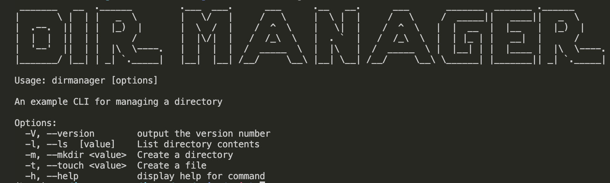
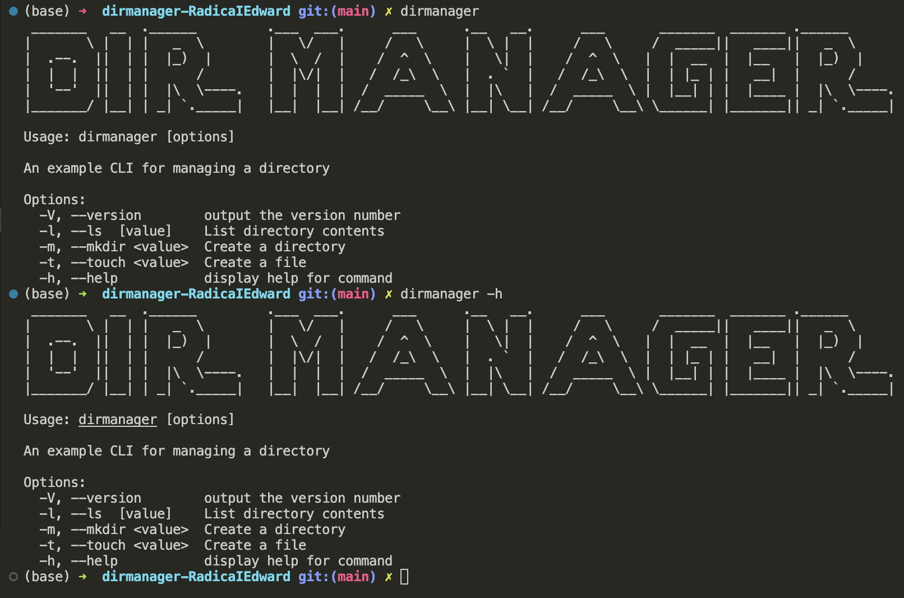
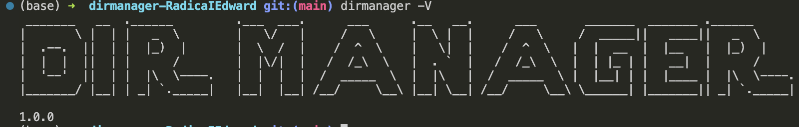
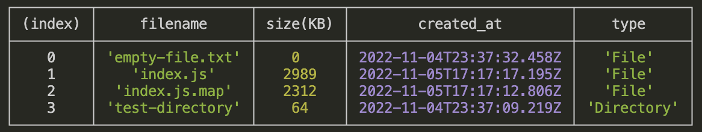
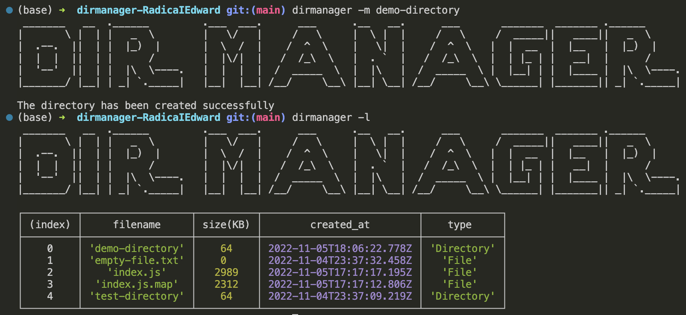
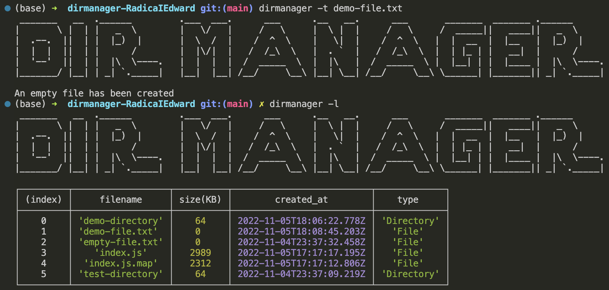

# DirManager

DirManager is a command line application that allows you to to manage and view information about directories on your computer.

## Help

To get to the help menu, you can type **dirmanager -h** or simply type the **dirmanager** command.

## Version

Using the **--version** or **-V** flags will tell you what version of DirManager you are currently using.

## List Directory

Using the **-l** or **--ls** flag will list the contents of the directory you are currently in. If you provide a file path after the flag, it will list the contents of the provided directory.

## Create a Directory

Using the **-m** or **--mkdir** flags, followed by a new folder name you wish to create will make that folder in the current directory.

## Create a File

Using the **-t** or **--touch** flags, followed by a new file name you wish to create will make that file in the current directory.

